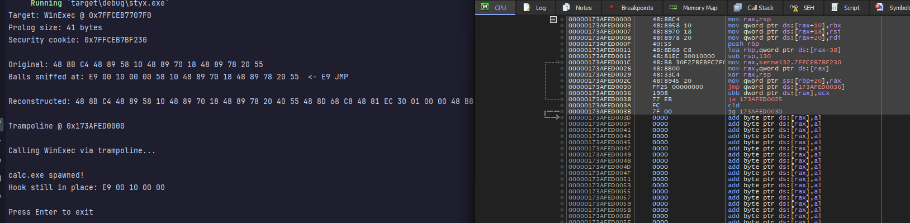
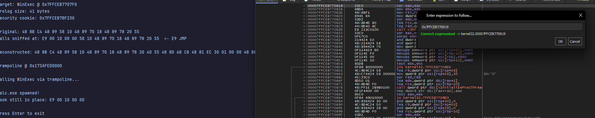
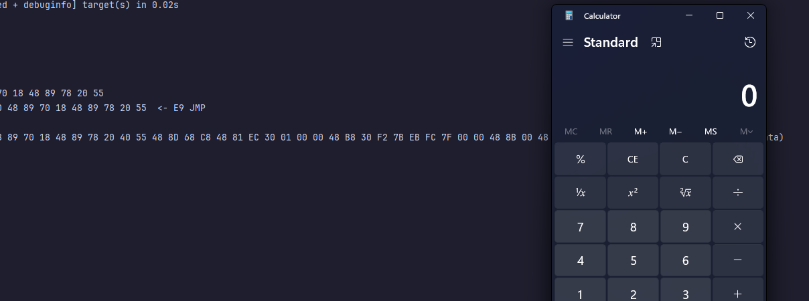

# Styx

*Named after the River Styx from Greek mythology, the line that separates the living from the dead, which souls must cross but cannot return from.*

## Abstract

Styx bypasses inline function hooks by reconstructing prologs from PE exception metadata rather than reading hooked memory or disk. Windows x64 binaries contain `.pdata` sections with `UNWIND_INFO` structures that describe prolog operations for stack unwinding. Since this metadata isn't executable, it's never hooked. Styx parses these structures, regenerates equivalent machine code, and builds a trampoline that executes the reconstructed prolog before jumping past the hook. `UNWIND_INFO` has historically only been used to manipulate stack for spoofing, not to generate code.

Extensive efforts have been made to confirm this is not a technique specified in any public research.

## Background

EDRs hook functions by overwriting prologs with `jmp` instructions. Existing bypass techniques include but are not limited to:

**Unhooking from disk** - Read original bytes from `C:\Windows\System32\ntdll.dll` via `CreateFile`/`ReadFile` or `NtReadFile`, then overwrite hooked `.text` section with `VirtualProtect` + `memcpy`. EDRs monitor file handles to system DLLs via minifilter callbacks, and periodically hash `.text` sections to detect restoration. Some EDRs also hook `NtProtectVirtualMemory` to catch the permission change.

**Direct syscalls** - Resolve the syscall number (SSN) dynamically and build a stub in executable memory: `mov r10, rcx; mov eax, SSN; syscall; ret`. Techniques like Hell's Gate parse ntdll's `Zw*` exports to extract SSNs at runtime. Only works for ntdll stubs - kernel32/user32 functions contain actual logic (string parsing, handle management, multiple internal calls) that can't be reduced to a single syscall.

**Indirect syscalls** - Instead of executing `syscall` from attacker-controlled memory (detectable via return address inspection), find a `syscall; ret` gadget inside ntdll and `jmp` to it. The return address now points to ntdll, appearing legitimate. This still only works for syscall stubs as you're jumping directly to the syscall instruction, skipping all function logic. Stack spoofing can fake the call chain, but EDRs have other detection vectors, namely kernel callbacks (`PsSetCreateThreadNotifyRoutine`, `ObRegisterCallbacks`) see the true origin of execution, ETW telemetry logs syscall patterns, and instrumentation callbacks (`NtSetInformationProcess` with `ProcessInstrumentationCallback`) can inspect every user-kernel transition regardless of stack state.

**Manual mapping** - Load a clean DLL copy into memory via `NtCreateSection`/`NtMapViewOfSection`. EDRs detect this by comparing the PEB's `InLoadOrderModuleList` against VAD entries, so manually mapped images appear in VAD as `MEM_IMAGE` regions but have no corresponding PEB entry. Tools like Volatility's `ldrmodules` exploit this discrepancy. Even unlinking from PEB doesn't help since VAD is kernel-managed.

All existing public techniques either read from disk, modify hooked memory, or only work for syscalls. Styx works for any function with UNWIND_INFO, it reconstructs the prolog and executes the real function body, not just a syscall stub.

Because Styx executes the actual function, any syscalls it makes go through the legitimate chain of execution: `WinExec` → kernel32 internals → ntdll → syscall. This removes the structural syscall anomalies that direct/indirect syscalls create, so there are no missing ntdll frames or abnormal stub origins.

Combined with techniques such as stack spoofing or removing RWX permissions on the trampoline, this makes Styx virtually indistinguishable from legitimate execution.

## Technique

Styx takes the .pdata and assumes the state that must exist after the prolog completes.

UNWIND_INFO doesn't describe instructions, it describes **effects**. For example, which registers must be restored, how much stack to unwind, whether a frame pointer exists. It appears MS designed this metadata to allow recovery of execution state without knowing original instructions.

This means:
- Hooks can destroy bytes, but not semantic requirements
- The ABI still demands correctness after the prolog
- Multiple valid instruction sequences can produce the same post-prolog state

The nice part about the technique is that it's not really guesswork but rather constrained by the x64 ABI, MSVC codegen contracts, and /GS requirements. When we infer `MOV RAX, RSP` before `SAVE_NONVOL` operations, that's because the ABI mandates it. When we reconstruct security cookies, that's because `/GS` semantics require it.

Windows stores prolog semantics in `.pdata` for exception handling:

```
UWOP_PUSH_NONVOL  →  push reg
UWOP_ALLOC_LARGE  →  sub rsp, imm
UWOP_SAVE_NONVOL  →  mov [rsp+X], reg
```

Styx reconstructs the prolog by:

1. Locating `RUNTIME_FUNCTION` in `.pdata` by function RVA
2. Parsing `UNWIND_INFO` unwind codes in reverse (they're stored in epilog order)
3. Generating machine code for each operation
4. Inferring patterns not in UNWIND_INFO (MOV RAX,RSP prefix, LEA RBP frame setup)
5. Reconstructing security cookie setup from Load Config Directory
6. Building a trampoline: reconstructed prolog + absolute JMP past hook

## Implementation

### Locating UNWIND_INFO

```rust
let rt = find_runtime_function(base, func_rva);
let unwind_rva = rt.UnwindInfoAddress;
```

### Parsing unwind codes

Codes are stored epilog-order. Via reverse iteration gives us the prolog order:

```rust
for (op, info, extra) in ops.iter().rev() {
    match *op {
        UWOP_PUSH_NONVOL => out.push(0x50 + info),
        UWOP_ALLOC_SMALL => out.extend(&[0x48, 0x83, 0xEC, size]),
        UWOP_SAVE_NONVOL => { /* mov [rax+off], reg */ }
        // ...
    }
}
```

### Inferring missing operations

UNWIND_INFO only tracks stack frame changes. We infer:

- `MOV RAX, RSP` when SAVE_NONVOL operations exist (they reference RAX)
- `LEA RBP, [RSP-X]` when RBP is pushed with frame pointer pattern
- Security cookie setup from Load Config Directory

### Security cookie reconstruction

Functions compiled with `/GS` (stack buffer security check) XOR a global cookie with RSP and store it on the stack. The epilog verifies this value, which if corrupted, `__security_check_cookie` terminates the process.

The cookie address lives in the PE's Load Config Directory at offset 88. UNWIND_INFO doesn't track this because it's not a stack frame operation but rather instrumentation. Without reconstructing it, the function crashes on return:

```rust
if let Some(cookie_addr) = get_security_cookie(base) {
    // MOV RAX, imm64    ; load cookie address
    // MOV RAX, [RAX]    ; dereference to get cookie value
    // XOR RAX, RSP      ; combine with stack pointer
    // MOV [RBP+0x20], RAX  ; store for epilog check
}
```

### Trampoline construction

```rust
ptr::copy(reconstructed.as_ptr(), trampoline, len);
// Absolute JMP: FF 25 00 00 00 00 [8-byte target]
ptr::write_unaligned(jmp_addr, (original + prolog_size) as u64);
```

## Results

```
Target: WinExec @ 0x7FFCEB7707F0
Prolog size: 41 bytes
Security cookie: 0x7FFCEB7BF230

Original: 48 8B C4 48 89 58 10 48 89 70 18 48 89 78 20 55 
Balls sniffed at: E9 00 10 00 00 58 10 48 89 70 18 48 89 78 20 55  <- E9 JMP

Reconstructed: 48 8B C4 48 89 58 10 48 89 70 18 48 89 78 20 40 55 48 8D 68 C8 48 81 EC 30 01 00 00 48 B8 30 F2 7B EB FC 7F 00 00 48 8B 00 48 33 C4 48 89 45 20  (48 bytes from metadata)

Trampoline @ 0x1FF22900000

Calling WinExec via trampoline...

calc.exe spawned!
Hook still in place: E9 00 10 00 00
```

Trampoline at `0x173AFED0000` showing reconstructed prolog with security cookie setup and final JMP:



Jump target at `kernel32.7FFCEB770819` (WinExec + 41), landing past the hooked prolog:



Voila! A calculator is spawned via WinExec.


## Limitations

- Requires UNWIND_INFO (most Win32 API functions have it)
- Does not bypass hooks placed after the prolog

### Prolog patterns not currently handled

UNWIND_INFO encodes stack frame effects for unwinding, not a complete instruction listing. This PoC infers common patterns but does not handle:

- `__chkstk` stack probes (triggered by allocations >4KB)
- Hotpatch padding (`MOV EDI, EDI` / NOP sleds)
- CFG dispatch patterns
- `UWOP_SAVE_XMM128` - slots counted but not reconstructed
- `UWOP_SET_FPREG` - frame pointer via different register
- Chained unwind info (functions with multiple RUNTIME_FUNCTION entries)
- Compiler/version-specific idioms

This technique works for functions whose prologs match already known patterns (like WinExec). Extending to other functions requires adding inference for their specific patterns.

## Build

```
cargo build --release
```

## References

- [x64 Exception Handling](https://docs.microsoft.com/en-us/cpp/build/exception-handling-x64) - UNWIND_INFO and RUNTIME_FUNCTION
- [x64 Calling Convention](https://docs.microsoft.com/en-us/cpp/build/x64-calling-convention) - Register preservation, stack layout
- [PE Format Specification](https://docs.microsoft.com/en-us/windows/win32/debug/pe-format) - .pdata, Load Config Directory
- [/GS Buffer Security Check](https://docs.microsoft.com/en-us/cpp/build/reference/gs-buffer-security-check) - Security cookie mechanism
- [Hell's Gate](https://github.com/am0nsec/HellsGate) - Dynamic syscall number resolution
- [Halo's Gate](https://blog.sektor7.net/#!res/2021/halosgate.md) - Hell's Gate variant for hooked ntdll
- [SysWhispers2](https://github.com/jthuraisamy/SysWhispers2) - Direct syscall stubs
- [SysWhispers3](https://github.com/klezVirus/SysWhispers3) - Indirect syscalls via jumps to ntdll
- [Defeating EDR Evading Malware with Memory Forensics](https://www.volexity.com/wp-content/uploads/2024/08/Defcon24_EDR_Evasion_Detection_White-Paper_Andrew-Case.pdf) - VAD/PEB analysis
- [Volatility ldrmodules](https://volatility3.readthedocs.io/en/latest/volatility3.plugins.windows.ldrmodules.html) - Detecting unlinked DLLs
